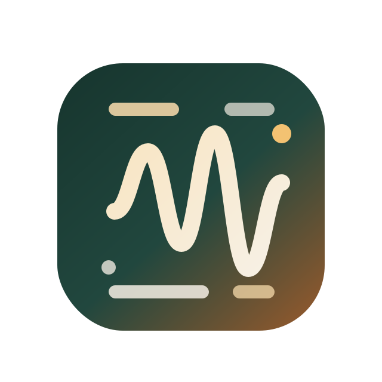

<p align="center">
  
</p>

# LocalScribe

LocalScribe is a local-first macOS live transcription control room for meetings, interviews, podcasts, presentations, and streamed playback.

It runs in the browser on your own Mac, keeps speech recognition local, shows a live editable transcript, tracks speaker changes, supports WhisperKit model management from the UI, and can use a local AI assistant to stabilize punctuation, names, acronyms, and turn-to-turn context while capture is running.

## Release status

Current release: `v0.2.3`

LocalScribe is ready for developer use on macOS, especially Apple Silicon. It is best treated as a serious local transcription workspace rather than a notarized consumer desktop app.

## What it does

- Live microphone transcription in Safari or Edge
- Browser or shared-audio capture from the browser
- Native macOS system-audio capture with a ScreenCaptureKit helper
- Managed local WhisperKit server startup
- Whisper model installation and switching from the UI
- Speaker-aware segmentation, speaker markers, and editable speaker labels
- Rolling context linking across live turns
- Optional local AI assistant backends with Ollama or MLX
- Saved sessions and export in TXT, Markdown, SRT, VTT, and JSON

## Best fit

LocalScribe is strongest on Apple Silicon Macs because it is designed around WhisperKit.

- Apple Silicon: preferred path
- Intel Mac: supported, but use `faster-whisper` instead of WhisperKit

## Quick Start

Fastest setup on a new Mac:

```bash
git clone <your-repo-url>
cd localscribe
bash scripts/bootstrap-macos.sh
source .venv/bin/activate
LOCALSCRIBE_ENGINE=whisperkit LOCALSCRIBE_WHISPER_MODEL=tiny uv run localscribe --reload
```

Then open `http://127.0.0.1:8765` in Safari or Edge.

## Install on a New macOS System

These steps assume a fresh Mac with no project dependencies installed yet.

### 1. Install Apple command line tools

```bash
xcode-select --install
```

### 2. Install Homebrew

If Homebrew is not installed yet, install it from [brew.sh](https://brew.sh), then confirm:

```bash
brew --version
```

### 3. Install system dependencies

Required for the main app:

```bash
brew install python@3.12 uv ffmpeg node
```

Recommended on Apple Silicon:

```bash
brew install whisperkit-cli
```

Optional for the local AI assistant:

```bash
brew install ollama
```

What these are for:

- `python@3.12`: runtime for the app
- `uv`: environment and dependency manager
- `ffmpeg`: audio normalization and decoding
- `node`: frontend/E2E tooling
- `whisperkit-cli`: local WhisperKit server for Apple Silicon
- `ollama`: optional local AI assistant runtime

### 4. Clone the repository

```bash
git clone <your-repo-url>
cd localscribe
```

### 5. Create the virtual environment

```bash
uv venv
source .venv/bin/activate
```

### 6. Install Python dependencies

```bash
uv sync --extra dev
```

This installs the LocalScribe app runtime, test tooling, and optional MLX runtime support.

If you want a one-command setup, you can run:

```bash
bash scripts/bootstrap-macos.sh
```

### 7. Start the app

For Apple Silicon:

```bash
LOCALSCRIBE_ENGINE=whisperkit LOCALSCRIBE_WHISPER_MODEL=tiny uv run localscribe --reload
# if you want to use a different model, replace tiny with your desired model

```

For Intel Macs:

```bash
LOCALSCRIBE_ENGINE=faster-whisper LOCALSCRIBE_FASTER_WHISPER_MODEL=base uv run localscribe --reload
```

If you want a custom app port:

```bash
LOCALSCRIBE_PORT=9000 uv run localscribe --reload
```

### 8. Open the app in Safari or Edge

Open:

```text
http://127.0.0.1:8765
```

If you changed the app port, replace `8765` with your chosen port.

Then allow:

- microphone access for live mic capture
- screen recording or screen sharing permissions if you want browser/system-audio capture

### 9. Let the first model finish installing

On first launch:

- `tiny` is the fastest way to confirm the app works
- `large-v3-turbo` is the better day-to-day model once setup is stable
- the first model download can take a while and uses significant disk space

After the app is open, use the model panel to:

- see which models are installed
- install missing models
- switch the active model without leaving the UI

## First Run Workflow

1. Open the page in Safari or Edge.
2. Choose `Live microphone` or `Browser or system audio`.
3. Choose a scenario preset such as meeting, podcast, discussion, oral presentation, TV news, or interview.
4. Adjust `Live segment length`.
5. Click `Create Session`.
6. Click `Start Live Mic`.
7. Watch the live caption line update, then settle into speaker-aware transcript turns in real time.

## Optional Features

### Native macOS system audio

For system output capture without browser limitations, use the helper in:

- [Native system audio guide](docs/NATIVE_SYSTEM_AUDIO.md)

### Local AI assistant with Ollama

For the default local AI assistant path:

```bash
brew install ollama
ollama pull qwen2.5:3b-instruct
```

LocalScribe uses Ollama by default when it is available and starts it automatically when the app launches.

### Optional local AI assistant with MLX

If you prefer MLX:

```bash
export LOCALSCRIBE_ENABLE_POST_PROCESSING=1
export LOCALSCRIBE_POSTPROCESS_BACKEND=mlx
export LOCALSCRIBE_POSTPROCESS_MODEL=mlx-community/Qwen2.5-3B-Instruct-4bit
```

This is useful when you want an on-device assistant path without running Ollama.

## Troubleshooting

### Safari or Edge shows no microphone devices

Click `Refresh Devices`, then grant microphone permission when the browser asks.

### Browser audio does not work reliably

Safari and Edge both work well for microphone capture. Edge is a better fit for browser tab audio. For system output capture:

- use a loopback device
- or use the native ScreenCaptureKit helper

### WhisperKit does not start

Check that this works:

```bash
whisperkit-cli --help
```

If not, reinstall it:

```bash
brew reinstall whisperkit-cli
```

### You want a smaller fallback path

Use:

```bash
export LOCALSCRIBE_ENGINE=faster-whisper
export LOCALSCRIBE_FASTER_WHISPER_MODEL=base
```

### The AI assistant shows as unavailable

For Ollama, confirm it is installed and the default model is available:

```bash
brew install ollama
ollama pull qwen2.5:3b-instruct
```

For MLX:

```bash
uv sync --extra dev
```

## Documentation

- [Local run tutorial](docs/LOCAL_RUN_TUTORIAL.md)
- [Native system audio guide](docs/NATIVE_SYSTEM_AUDIO.md)

## Project layout

```text
localscribe/
  docs/
  native/
  src/localscribe/
    api/
    context/
    diarization/
    engines/
    exports/
    postprocess/
    speakers/
    static/
    storage/
    streaming/
  tests/
```

## Development

Run tests:

```bash
uv run pytest tests
```

Run the E2E test suite:

```bash
npm install
npm run test:e2e
```

Run the dedicated Edge smoke test:

```bash
npm run test:e2e:edge
```

Check the frontend script:

```bash
node --check src/localscribe/static/app.js
```

## License

This repository now includes the [MIT License](LICENSE).
